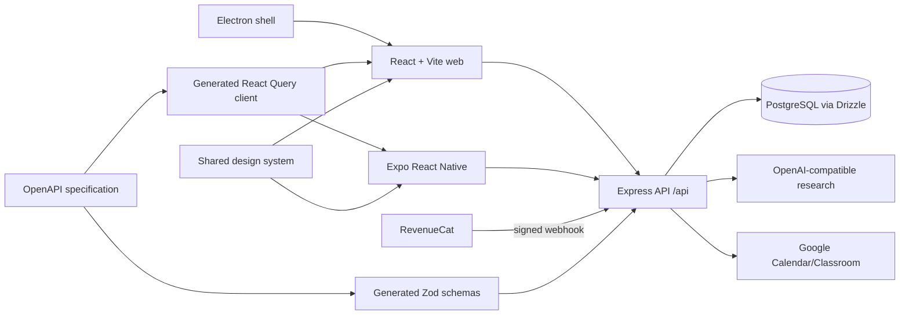

# Casparel product and engineering handbook

Last verified: 15 August 2026

This is the canonical overview of what Casparel is, how its parts fit together, how to operate it, and where its boundaries are. Implementation details are grounded in the repository at the date above; product claims should be changed here when behaviour changes.

## 1. Product definition

Casparel is a cross-platform learning workspace for two primary audiences:

- Students discover credible learning material, organise it around goals, schedule study, collaborate, and preserve evidence of progress.
- Teachers manage classes, recommend and assign resources, review student work, and use learning signals to support students.

The product's strongest differentiator is the path from **discovery → source evaluation → organised study → evidence**, not a generic social feed or a generic AI chatbot. The public educational-resource library and quick source check remain useful without Premium. Premium removes account-level limits from deep live-web source research.

### Roles and access

| Role/state | Principal capabilities                                                                                                      |
| ---------- | --------------------------------------------------------------------------------------------------------------------------- |
| Signed out | Landing page, public library search and resource details, terms/privacy, registration/login                                 |
| Student    | Goals, schedules, resources/lists, classes, activities, canvases, messaging, forum, profile and evidence                    |
| Teacher    | Student capabilities plus class management, assignments/recommendations, notes, seating tools, Google Classroom integration |
| Admin      | Moderation, user/class/work controls, verification queues, usage/cost overview                                              |
| Premium    | Unlimited account-level deep source research; the server-wide safety budget still applies                                   |

Authentication uses a signed bearer token stored under the legacy key `schoolar_token` on web and mobile. That key is a compatibility contract and must not be renamed casually.

## 2. User-facing surfaces

### Web application

The React/Vite app is the complete product surface.

| Area       | Pages                                                       | Purpose                                                                |
| ---------- | ----------------------------------------------------------- | ---------------------------------------------------------------------- |
| Public     | Landing, login, registration, legal, resource browse/detail | Acquisition, public discovery, trust and account entry                 |
| Home       | Dashboard, adaptive dashboard, guide/tutorial               | Personal orientation, recommended next action and onboarding           |
| Learning   | Goals, activities, schedule, canvases                       | Planning, focused work and evidence of learning                        |
| Resources  | Search/library, resource detail, lists/list detail, catalog | Public and saved discovery, source evaluation, citation, collections   |
| Community  | People, profiles, messages, forum                           | Safe discovery and collaboration                                       |
| Teaching   | Classes and class detail                                    | Membership, assignments, resources, goals, notes and seating workflows |
| Account    | Profile and settings                                        | Identity, preferences, integrations, privacy and plan state            |
| Operations | Admin                                                       | Verification, moderation, account support and AI-usage visibility      |

Important resource behaviour:

- The empty search view loads six top-rated public resources so a new visitor has an immediate path forward.
- Search combines the Casparel library with an open education catalog.
- Optional AI discovery is a fallback only when stored/remote catalog search has no result and the relevant feature flag is enabled.
- A quick source check uses model knowledge; deep research uses live web research and returns cited strengths, concerns, limitations, currency and reputation analysis.
- Users may remove only resources they submitted; public search cards must not expose another author's removal action.

### Mobile application

The Expo Router app provides focused native flows:

- onboarding and login;
- dashboard/home;
- classes and class detail;
- schedule;
- resource browse and resource detail;
- quick and deep source review;
- profile, usage and the Free/Plus/Pro paywall.

The native identifiers are `com.casparel.app`; the Expo slug and URL scheme are `casparel`. RevenueCat is loaded behind a platform-safe adapter, uses `plus` and `pro` entitlements, preserves historical `premium` buyers as Pro, and logs in with the numeric Casparel user ID before purchase or restore so transactions reconcile to the server account.

The mobile app is intentionally narrower than the web app. It does not currently provide the full web experiences for goals, canvases, lists, messaging, forum, activities, admin, or AI-assisted open-catalog discovery. Paywall and onboarding copy must not imply that missing native experiences exist. Shared links for implemented resource and class details are normalized to native routes; a valid link survives login and first-run onboarding, while web-only or malformed destinations fall back safely.

Secure session recovery requires a matching token and cached account profile. Partial/corrupt storage is cleared, and a protected API 401 signs the native client out and clears private query data instead of leaving it in a broken authenticated state. Store release acceptance still requires clean-install, login, deep-link and text-scaling checks on physical iOS and Android devices.

### Desktop application

The Electron package is a controlled shell around `CASPAREL_URL` (default `https://casparel.com`). It accepts only a credential-free HTTP(S) app origin, keeps deep links on that origin, hands approved web links to the system browser, blocks unsafe protocols, and denies sensitive permissions to third-party frames. Embedded-resource failures preserve the app; a main-frame outage shows an honest constrained offline page. It compiles its main/preload processes separately and has a six-scenario real-window smoke suite. It is not a separate offline client.

### Shared design system

`artifacts/schoolar-edu` is the shared web/native component and token package. The historical package name remains for compatibility, while generated CSS, TypeScript tokens, fonts, radius, colour and primitive components give the web and mobile clients a common visual language.

## 3. System architecture



### Repository layout

| Path                                | Responsibility                                                         |
| ----------------------------------- | ---------------------------------------------------------------------- |
| `artifacts/api-server`              | Express 5 API, auth/authorization, integrations, migrations at startup |
| `artifacts/app`                     | React 19 + Vite web SPA and browser audit fixtures                     |
| `artifacts/mobile`                  | Expo 54 / React Native 0.81 app                                        |
| `artifacts/desktop`                 | Electron shell, deep links and packaging                               |
| `artifacts/schoolar-edu`            | Shared design tokens and components                                    |
| `lib/api-spec`                      | OpenAPI source of truth                                                |
| `lib/api-client-react`              | Generated React Query client; never hand-edit generated files          |
| `lib/api-zod`                       | Generated request/response schemas; never hand-edit generated files    |
| `lib/db`                            | Drizzle schema and ordered migrations                                  |
| `lib/integrations-openai-ai-server` | OpenAI-compatible integration                                          |
| `load-tests`                        | k6 read-only smoke/public/authenticated profiles                       |
| `scripts`                           | startup, build portability and production smoke checks                 |

### Request lifecycle

The server mounts API routes below `/api`, applies security headers, CORS/body limits and rate limits, authenticates signed bearer tokens where required, validates typed surfaces with generated Zod schemas, and reads/writes Postgres through Drizzle or parameterised SQL. Database migrations and schema-health checks run during startup.

The OpenAPI file currently covers the stable public core (auth, users, classes, resources, reviews, lists, schedule, sessions, goals, Google integrations, dashboard and learning evidence). Newer forum, messaging, workflow, activity, canvas, expanded admin and webhook surfaces are implemented as server routes but are not all represented in OpenAPI. This is known contract debt: those routes do not receive generated-client drift protection and should be migrated spec-first.

## 4. Data model

The database is organised around these domains:

- Identity and safety: users, user preferences, user safety/report state, activity log.
- Teaching: classes, class members, invitations, assignments, resource recommendations.
- Learning: learning goals, learning evidence, workflow events, study sessions, schedule blocks.
- Resources: public resources, catalog resources, reviews, source-review cache, resource lists and list items.
- Collaboration: conversations/messages, direct messages, forum content, comments/reports and canvases.
- Integrations: Google OAuth tokens and calendar tokens.

Schema changes require both a TypeScript schema edit and a generated migration committed together. The API invokes migrations at startup; direct `ALTER TABLE` or `drizzle push` is not an accepted release path. Timestamp columns that feed string schemas use Drizzle `mode: "string"`.

## 5. Authentication, plans and limits

### Sessions

- Registration and login return a signed token.
- Protected routes use `requireAuth`; privileged routes additionally require teacher/admin authorization.
- Expired or server-rejected tokens are cleared by the client and return the user to login.
- Logout clears client session state. Account deletion anonymises/disables the account rather than leaving active personal identity.

### Subscription reconciliation

The native client derives presentation state from RevenueCat, but the API remains the authority for gated features. After purchase or restore, the app calls authenticated `POST /api/users/me/entitlements/reconcile`; the server fetches RevenueCat Customer Info for that numeric account and updates only the plan and expiry. RevenueCat also calls `POST /api/webhooks/revenuecat` with a shared Authorization value for renewals, cancellation/expiry, transfers, and other lifecycle events. The server normalizes accounts to Free, Plus, or Pro and checks any recorded expiry; the historical `premium` value remains a compatibility alias for Pro.

Current plan boundaries:

- Free: library, classes, schedules, citations, and manual seating; no AI discovery or deep research.
- Plus: AI discovery defaults to 20 per account/day; deep research defaults to 5/day and 50 per rolling 30-day window.
- Pro: unlimited account-level AI and educator-only explainable seating-plan suggestions.
- Global provider budgets remain cost-safety limits for non-admin accounts, including Pro; “unlimited” therefore means no per-account allowance, not guaranteed provider capacity.

The usage endpoint reports server-derived plan and daily usage. Subscription state never grants platform administration or educator ownership: those capabilities remain separate authorization checks. Cancellation retains plan access until RevenueCat reports expiry; expiry returns the account to Free without deleting its library, classes, or other user data.

## 6. Discovery and research

Discovery is deliberately layered to contain cost and improve provenance:

1. Query Casparel's stored public library.
2. Query the locally stored open catalog.
3. Fetch and cache Open Library/Wikibooks material when the first catalog page is sparse.
4. Only when no catalog result is available and a feature flag allows it, use the paid AI fallback.

Search results carry provenance and are deduplicated by canonical work/URL. Resource submission, public visibility and verification are separate states so pending/rejected work does not leak into the public library.

Search relevance has a versioned 36-query benchmark spanning secondary-school learning, research/reference intent, Turkish queries and ambiguous terms. The automated pass measures result count, intent inference, provider diversity/concentration, reference/archive concentration and meaningful-preview coverage. Pedagogical usefulness remains a human judgment: reviewers score every top-10 result, and the release gate requires aggregate useful Precision@5 of at least 0.80 plus no obviously irrelevant top-three result in critical AP queries. Missing API configuration, an incomplete review sheet, and an actual ranking failure are separate statuses and must not be collapsed into “pass” or “fail.”

Source-review results are cached. Deep mode limits concurrent work for a user/resource, applies user and global quotas, and asks for explicit limitations rather than presenting an AI trust label as fact. The interface should preserve supporting links and uncertainty.

## 7. Integrations

| Integration           | Purpose                                                | Required configuration                                                |
| --------------------- | ------------------------------------------------------ | --------------------------------------------------------------------- |
| PostgreSQL            | Persistent application state and quota counters        | `DATABASE_URL`                                                        |
| OpenAI-compatible API | Discovery fallback and source research                 | `AI_INTEGRATIONS_OPENAI_BASE_URL`, `AI_INTEGRATIONS_OPENAI_API_KEY`   |
| Google Classroom      | Course import, students and resource sharing           | Google client ID/secret and redirect URI                              |
| Google Calendar/iCal  | Calendar connection and exported feeds/events          | Google client ID/secret; calendar redirect URI where needed           |
| RevenueCat            | Native products, offerings and entitlement state       | native public SDK keys; `REVENUECAT_WEBHOOK_AUTH` on server/dashboard |
| Hostinger             | Production frontend/API hosting and smoke verification | deployment secrets and `SITE_URL` in GitHub                           |

Secrets belong in host-managed environment variables or a gitignored `.env`, never client source or committed documentation.

## 8. Configuration

Copy `artifacts/api-server/.env.example` for the authoritative server list. Boot requires:

- `DATABASE_URL`;
- `SESSION_SECRET`;
- `AI_INTEGRATIONS_OPENAI_BASE_URL`;
- `AI_INTEGRATIONS_OPENAI_API_KEY`.

Optional controls include RevenueCat webhook auth, Google OAuth settings, admin allowlist, CORS origins, catalog remote-fetch controls, AI fallback flags/quotas, logging, and strict database-readiness mode. The server defaults to port 8080 on Replit and 5000 locally. The web dev server defaults to 23863 and reads `API_URL`; never hardcode these values.

Mobile native builds also need the platform RevenueCat public SDK keys expected by `utils/revenuecat.ts`. A key is public client configuration, but it must still point to the correct RevenueCat project and store products.

## 9. Development workflow

```bash
pnpm install --frozen-lockfile
pnpm --filter @workspace/api-server run dev
pnpm --filter @workspace/app run dev
pnpm --filter @workspace/mobile run dev
pnpm --filter @workspace/edu-ds run dev
```

Quality gates:

```bash
pnpm run typecheck
pnpm --filter @workspace/api-server exec vitest run
pnpm --filter @workspace/api-server run build
pnpm --filter @workspace/app run build
node artifacts/app/scripts/audit-pages.mjs
node artifacts/app/scripts/audit-session.mjs
pnpm --filter @workspace/desktop run compile
pnpm --filter @workspace/desktop run smoke
```

Search-quality gate against a seeded staging API:

```bash
SEARCH_BENCHMARK_BASE_URL=https://staging.example/api \
  pnpm --filter @workspace/api-server benchmark:search

SEARCH_BENCHMARK_REVIEW_CSV=/absolute/path/to/search-human-review.csv \
  pnpm --filter @workspace/api-server benchmark:search:review
```

The first command writes ignored JSON/Markdown evidence plus a CSV rubric under `artifacts/api-server/test-results/search`. Complete the generated rubric without changing query/intent/rank columns, then run the second command. Do not point the first command at production casually: discovery may enrich the catalog or consume an enabled provider fallback.

When the API contract changes, edit `lib/api-spec/openapi.yaml` and run:

```bash
pnpm --filter @workspace/api-spec run codegen
```

Do not hand-edit either generated directory. When the database changes, edit the Drizzle schema, run the database generator, inspect/guard the migration, and commit schema plus migration together.

## 10. Test strategy

The test pyramid has four layers:

- Static: TypeScript across libraries, web, API, desktop, design system, scripts and mobile.
- API: Vitest/Supertest coverage for auth, authorization, resources, discovery/rate limits, source review, verification, classes, lists, webhooks and health.
- Browser: built-app page sweeps across public/signed-in routes, dark/light palettes and desktop/mobile widths; assertions cover runtime errors, contrast, invisible reveal content, accessible names/labels, heading order, alt text and overflow.
- Operational: session-expiry journey, Electron real-window smoke, production HTTP smoke, and k6 staging profiles.

The web bootstrap also performs one bounded recovery for a stale Vite lazy-chunk URL after a deployment. A repeat failure reaches the visible error boundary rather than looping or leaving a blank shell.

The browser fixtures are deterministic synthetic user journeys. They are not a substitute for interviews or moderated usability sessions. The research plan and current evidence are recorded in the audit report.

## 11. Deployment and operations

- CI installs from the lockfile, typechecks every workspace (including mobile), runs API tests, builds web, installs Chromium, runs visual/accessibility/session audits, compiles desktop and runs the Electron smoke test.
- The frontend deployment workflow builds with the canonical `SITE_URL`, publishes to Hostinger, and runs a post-deploy smoke check.
- The API build emits `artifacts/api-server/dist/index.mjs`; startup loads environment before the import graph, migrates the database, checks reachability/schema health, then listens on `PORT`.
- Desktop releases are handled by the desktop release workflow and platform packaging configuration.
- Mobile store delivery requires EAS/native credentials and completed App Store Connect / Play Console / RevenueCat product configuration; repository compilation alone does not publish a binary.

Operational first checks:

1. `GET /api/healthz` and deployment logs.
2. Confirm all required environment variables are bound.
3. Confirm migrations are present and startup migration output is clean.
4. Check `DATABASE_URL` reachability and schema-health logs.
5. Check RevenueCat webhook responses for entitlement incidents.
6. Run `BASE_URL=https://casparel.com pnpm run loadtest:smoke` only as a low-volume read check; use public/authenticated load profiles on staging.

The administrator overview reports authenticated browser field measurements over a rolling 30-day window. Reliability SLOs use p75 LCP ≤2,500 ms, INP ≤200 ms, CLS ≤0.1 and ≥99% error-free measured users. Telemetry is first-party and low-cardinality: it stores route families, metric/rating values and classified error kinds, never exact URLs, error messages, stacks, search text or learner content. A missing sample is displayed as unmeasured, not as a pass.

RevenueCat webhook event IDs are stored transactionally with entitlement updates. `TRANSFER` events fetch current Customer Info for every numeric source and destination alias before applying changes; failed lookups write no receipt and return an error so RevenueCat can retry. The authenticated post-purchase reconciliation endpoint uses the same server-only Customer Info lookup and never trusts a plan claimed by a client. Operators must configure both `REVENUECAT_WEBHOOK_AUTH` and `REVENUECAT_SECRET_API_KEY` before testing purchase, restore, expiry, or transfer scenarios.

## 12. Security, privacy and accessibility

Existing controls include password hashing, signed auth tokens, route authorization, content/rate limiting, parameterised queries, CORS controls, security headers, upload validation, moderation/reporting, minimal OAuth scope handling, server-side webhook authentication, and redaction-aware logging. The public terms/privacy pages and account deletion path are part of release acceptance.

Accessibility is enforced partly in the browser audit and partly through native labels/roles. High-risk interaction classes are icon-only controls, dynamic dialogs, data visualisations, paywall/package selection, mobile focus order and colour-token changes. Automated checks cannot establish screen-reader comprehension or cognitive usability; manual VoiceOver, TalkBack, Dynamic Type/font-scaling, reduced-motion and keyboard-only passes are required before store submission. Until those physical-device checks are recorded, native accessibility is an open release gate rather than a verified store claim.

## 13. Known boundaries and debt

- Several newer API domains are not yet specified in OpenAPI, so generated client/schema coverage is incomplete.
- Expo/Metro currently resolves `image-size` 1.2.1; npm reports high-severity [ICNS](https://github.com/advisories/GHSA-w3rx-r6r6-pgpr) and [JXL/HEIF](https://github.com/advisories/GHSA-5p2g-fcmc-qvqq) parser denial-of-service advisories, while the declared patched 2.0.3 release is not yet published. Treat untrusted ICNS/JXL/HEIF build input as unsafe and upgrade as soon as the fix exists.
- The free deep allowance combines a daily and 30-day cap; product copy intentionally says “allowance” rather than promising two reports every day.
- Mobile is a focused subset, not feature parity with web.
- The largest lazy web chunks (p5 and Three.js) are heavy; they are isolated from the initial route but should remain under route-level performance budgets.
- Production smoke measurements show availability/latency at low volume, not concurrency capacity. Capacity tests require staging and database telemetry.
- The SPA sets a single static document shell; route-specific crawl metadata is limited without SSR/prerendering.

See the dated audit and Shipaton readiness review for prioritised remediation.
