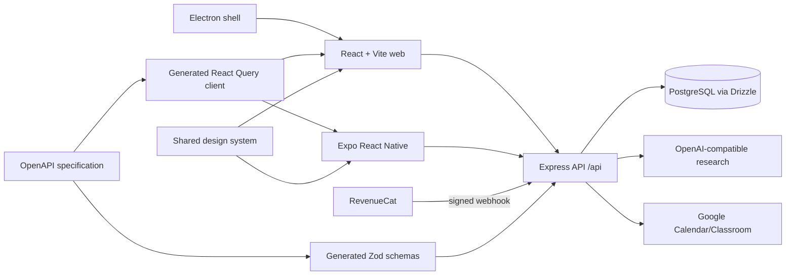

# Casparel product and engineering handbook

Last verified: 29 August 2026

This is the canonical overview of what Casparel is, how its parts fit together, how to operate it, and where its boundaries are. Implementation details are grounded in the repository at the date above; product claims should be changed here when behaviour changes.

## 1. Product definition

Casparel is a cross-platform learning workspace for two primary audiences:

- Students discover credible learning material, organise it around goals, schedule study, collaborate, and preserve evidence of progress.
- Teachers manage classes, recommend and assign resources, review student work, and use learning signals to support students.

The product's strongest differentiator is the path from **discovery → source evaluation → organised study → evidence**, not a generic social feed or a generic AI chatbot. The public educational-resource library and the non-AI quick source check remain fully useful on the free plan. The paid tiers sell two things together: AI research, and room to keep more of the work a class or a study year produces.

### Roles and access

| Role/state | Principal capabilities                                                                                                      |
| ---------- | --------------------------------------------------------------------------------------------------------------------------- |
| Signed out | Landing page, public library search and resource details, terms/privacy, registration/login                                 |
| Student    | Goals, schedules, resources/lists, classes, activities, canvases, messaging, forum, profile and evidence                    |
| Teacher    | Student capabilities plus class management, assignments/recommendations, notes, seating tools, Google Classroom integration |
| Admin      | Moderation, user/class/work controls, verification queues, usage/cost overview; the only uncapped accounts                  |
| Plus/Pro  | Role-agnostic paid plans with larger workspace and AI allowances; Pro adds the explainable seating planner              |

Authentication uses a signed bearer token stored under the legacy key `schoolar_token` on web and mobile. That key is a compatibility contract and must not be renamed casually.

## 2. User-facing surfaces

### Web application

The React/Vite app is the complete product surface.

| Area       | Pages                                                       | Purpose                                                                |
| ---------- | ----------------------------------------------------------- | ---------------------------------------------------------------------- |
| Public     | Landing, login, registration, legal, plans, resource browse/detail | Acquisition, public discovery, trust, plan comparison and account entry |
| Home       | Dashboard, adaptive dashboard, guide/tutorial               | Personal orientation, recommended next action and onboarding           |
| Learning   | Goals, activities, schedule, canvases                       | Planning, focused work and evidence of learning                        |
| Resources  | Search/library, resource detail, lists/list detail, catalog | Public and saved discovery, source evaluation, citation, collections   |
| Community  | People, profiles, messages, forum                           | Safe discovery and collaboration                                       |
| Teaching   | Classes and class detail                                    | Membership, assignments, resources, goals, notes and seating workflows |
| Account    | Profile and settings                                        | Identity, preferences, integrations, privacy and plan state            |
| Operations | Admin                                                       | Verification, moderation, account support and AI-usage visibility      |

Important resource behaviour:

- The empty search view loads six top-rated public resources so a new visitor has an immediate path forward.
- Search combines the Casparel library with an open education catalog.
- Optional AI discovery is a fallback only when stored/remote catalog search has no result and the relevant feature flag is enabled.
- The quick source check reads a maintained provenance registry and makes no model call, which is why it stays free; deep research uses live web research and returns cited strengths, concerns, limitations, currency and reputation analysis.
- The landing hero's source card shows **real catalogue sources with their real verdicts**, from `GET /resources/provenance-showcase`, in three tiers: a signed-in visitor's own saved resources (header reads "From your saved sources"), else the platform's most-saved, else — when no list holds anything yet — the newest catalogue resources. The third tier exists because a young library is exactly the deployment that must not be illustrated with sources it does not hold. Verdicts come from the same registry classification as the resource pages — deterministic, no model call, no outbound request, so a marketing card costs nothing to render. Four hardcoded examples remain as the fallback for a cold cache or an empty catalogue, and any error answers 200 with no entries so the hero degrades to those examples rather than breaking the page. Unverified submissions stay hidden by the usual visibility rule, so the endpoint cannot be used to enumerate the review queue.
- Users may remove only resources they submitted; public search cards must not expose another author's removal action.

### Mobile application

The Expo Router app provides focused native flows:

- onboarding and login;
- dashboard/home;
- classes and class detail;
- schedule;
- resource browse and resource detail;
- quick and deep source review;
- profile, usage and the plan paywall.

The native identifiers are `com.casparel.app`; the Expo slug and URL scheme are `casparel`. RevenueCat is loaded behind a platform-safe adapter, resolves only the current `plus` and `pro` entitlements in the client, and logs in with the numeric Casparel user ID so purchases can reconcile to the server account. Historical entitlement identifiers are handled only by the server during migration and webhook replay. On Android, a free account may receive one clearly labelled native AdMob card on the dashboard. Google UMP gates initialization, requests are non-personalized and use conservative under-age/content treatment, paid or indeterminate entitlements suppress the card, and RevenueCat Ads receives the supported lifecycle and impression-revenue callbacks. iOS and web remain ad-free.

The mobile app is intentionally narrower than the web app. It does not currently provide the full web experiences for goals, canvases, lists, messaging, forum, activities, admin, or AI-assisted open-catalog discovery. Paywall copy must not imply that missing native experiences exist.

### Desktop application

The Electron package is a controlled shell around `CASPAREL_URL` (default `https://casparel.com`). It validates navigation and deep links, preserves the window on embed failures, compiles its main/preload processes separately, and has a real-window smoke test. It is not a separate offline client.

### Shared design system

`artifacts/schoolar-edu` is the shared web/native component and token package. The historical package name remains for compatibility, while generated CSS, TypeScript tokens, fonts, radius, colour and primitive components give the web and mobile clients a common visual language.

## 3. System architecture



### Repository layout

| Path                                | Responsibility                                                         |
| ----------------------------------- | ---------------------------------------------------------------------- |
| `artifacts/api-server`              | Express 5 API, auth/authorization, integrations, migrations at startup |
| `artifacts/app`                     | React 19 + Vite web SPA and browser audit fixtures                     |
| `artifacts/mobile`                  | Expo 54 / React Native 0.81 app                                        |
| `artifacts/desktop`                 | Electron shell, deep links and packaging                               |
| `artifacts/schoolar-edu`            | Shared design tokens and components                                    |
| `lib/api-spec`                      | OpenAPI source of truth                                                |
| `lib/api-client-react`              | Generated React Query client; never hand-edit generated files          |
| `lib/api-zod`                       | Generated request/response schemas; never hand-edit generated files    |
| `lib/db`                            | Drizzle schema and ordered migrations                                  |
| `lib/integrations-openai-ai-server` | OpenAI-compatible integration                                          |
| `load-tests`                        | k6 read-only smoke/public/authenticated profiles                       |
| `scripts`                           | startup, build portability and production smoke checks                 |

### Request lifecycle

The server mounts API routes below `/api`, applies security headers, CORS/body limits and rate limits, authenticates signed bearer tokens where required, validates typed surfaces with generated Zod schemas, and reads/writes Postgres through Drizzle or parameterised SQL. Database migrations and schema-health checks run during startup.

The OpenAPI file currently covers the stable public core (auth, users, classes, resources, reviews, lists, schedule, sessions, goals, Google integrations, dashboard and learning evidence). Newer forum, messaging, workflow, activity, canvas, expanded admin and webhook surfaces are implemented as server routes but are not all represented in OpenAPI. This is known contract debt: those routes do not receive generated-client drift protection and should be migrated spec-first.

## 4. Data model

The database is organised around these domains:

- Identity and safety: users, user preferences, user safety/report state, activity log.
- Teaching: classes, class members, invitations, assignments, resource recommendations.
- Learning: learning goals, learning evidence, workflow events, study sessions, schedule blocks.
- Resources: public resources, catalog resources, reviews, source-review cache, resource lists and list items.
- Collaboration: conversations/messages, direct messages, forum content, comments/reports and canvases.
- Integrations: Google OAuth tokens and calendar tokens.

Schema changes require both a TypeScript schema edit and a generated migration committed together. The API invokes migrations at startup; direct `ALTER TABLE` or `drizzle push` is not an accepted release path. Timestamp columns that feed string schemas use Drizzle `mode: "string"`.

## 5. Authentication, plans and limits

### Sessions

- Registration and login return a signed token.
- Protected routes use `requireAuth`; privileged routes additionally require teacher/admin authorization.
- Expired or server-rejected tokens are cleared by the client and return the user to login.
- Logout clears client session state. Account deletion anonymises/disables the account rather than leaving active personal identity.

### Plans

Casparel has four backend tiers: `free`, `plus`, `pro`, and the sales-led school licence `institutional`. Student and teacher are account roles, not billing tiers. Plus and Pro use the same products, limits, and features for every role. Historical `premium`, student-specific, and teacher-specific database values are migrated to the matching generic tier.

**Plan and role are independent.** A `(plus, student)` account and a `(plus, teacher)` account receive the same subscription allowances. Switching role never changes, hides, or substitutes a paid product. `activeRole` remains only a workspace view mode.

**Institutional is sales-led, not checkout.** It is priced per seat, invoiced, manually provisioned on Casparel accounts, and never a RevenueCat store product. It sits at or above every other tier on every allowance and is still finite: a licensed seat is not an administrator. RevenueCat webhooks cannot overwrite this manual plan. When an institutional account hits a cap, the 402 says "contact support to extend your licence" instead of recommending a smaller plan (`upgradeTargetFor` returns `institutional` for institutional accounts).

**Nothing paid is uncapped.** Every allowance on every tier is finite; uncapped is an administrator property, not something money can buy. Legacy `premium` buyers now resolve to the large-but-finite Pro caps.

A plan governs two different things, and both matter:

- **Rate** — how much AI an account may consume per day or per month.
- **Capacity** — how many rows an account may accumulate. Every capacity maps to one table, so a tier is also a statement about how much database and backup an account occupies.

### Rate limits

Free is a deliberately subsidized taste: 1 discovery/day and 3/30 days, plus 1 deep report/30 days. Current paid day/month limits, operation bounds, provider assumptions, worst-case costs, and margins are maintained in [`docs/plan-economics.md`](plan-economics.md) and machine-tested from `@workspace/plan-economics`. The quick source check remains a non-AI registry operation.

Both AI features enforce day, rolling-30-day, concurrency, timeout, output, paid-tool, and service-wide emergency ceilings. Institutional seats additionally share one contract pool. A fresh cache hit is returned before quota consumption and records avoided cost for the admin economics panel.

### Capacity limits

Defined once in `CAPACITY_BY_TIER` in `artifacts/api-server/src/lib/entitlements.ts`, which the usage endpoint, the enforcement helper and the tests all read, so a displayed limit and an applied limit cannot drift apart.

| Capacity          | Free | Plus |  Pro | Institutional |
| ----------------- | ---: | ---: | ---: | ------------: |
| Classes owned     |    1 |    5 |   20 |            50 |
| Members per class |   30 |  100 |  300 |           500 |
| Study activities  |   25 |  250 | 1000 |          2500 |
| Resource lists    |    5 |   50 |  200 |           500 |
| Learning goals    |   10 |  100 |  400 |           800 |
| Canvases          |    3 |   30 |  100 |           250 |

Rules that hold across every capacity:

- Counts are read at write time, so a downgrade takes effect on the next creation attempt with no reconciliation job.
- Nothing is deleted or hidden when a plan shrinks. An account over its limit keeps everything it has and simply cannot add more of that kind until it is back under.
- A refusal is `402` with `code: "PLAN_LIMIT_REACHED"` and the `capacity`, `limit`, `used` and `requiredPlan` as fields, so a client can render a meter without parsing the sentence.
- `requiredPlan` names the cheapest plan that would actually fit the request, so a teacher who needs a 400-seat roster is pointed at Pro rather than at a Plus plan that would refuse them again.
- **Class rosters are charged to the teacher who owns the class, never to the student joining it.** A free student joining a Pro teacher's class is never blocked by their own plan.
- Admin accounts are uncapped on capacity, matching how they bypass the AI quotas.

Every account-owned capacity, its current usage and its limit are returned by `GET /api/users/me/usage` alongside the AI counters.

### Pricing

The canonical USD reference prices and quotas live in `@workspace/plan-economics`, imported by the API, web pricing page, mobile paywall, tests, and store-ID mapping. Annual prices are based on twelve full months of maximum usage and discount only 8–10%; no plan assumes two idle months.

Self-serve monthly prices are Plus $9.99 and Pro $19.99. Annual prices are $109.99 and $214.99 respectively. Institutional is advertised at $2.50–$3.00 per seat/month, billed annually, with a 30-seat minimum and contact-for-quote pricing; it is never a store product.

The full cost table, quota rationale, provider assumptions, migration policy, and exact Google Play/RevenueCat values are in [`docs/plan-economics.md`](plan-economics.md). CI rejects any quota or provider-price change that takes a monthly or annual plan below 70% worst-case gross margin.

### Feature placement

Two named experiences sit at the centre of the product and deserve explicit placement, not just a row in a table.

**The personal assistant (adaptive dashboard).** Casparel's assistant surface is the adaptive dashboard: it takes the active learning goal's path steps, confidence check-ins and captured evidence, and recommends the next action, scoring library resources with a ratings-based effectiveness heuristic. It is deliberately **free on every tier** — it is the activation loop (registered → first goal → first action → return), and charging for the thing that teaches people why the product matters would starve every paid tier of future buyers. It makes **no model calls**: everything on it is computed from the account's own rows. Its check-ins write learning-evidence rows, which are not yet capacity-metered (see boundaries). A model-backed personal assistant is a roadmap candidate for the Student ladder, not a shipped feature, and must not be described as existing.

**The seating arrangement suite.** Four pieces, individually placed:

| Piece | What it is | Plan |
| --- | --- | --- |
| Classroom Designer | Manual grid or free-form room: tables in four shapes plus room elements — single chairs, a teacher podium, a whiteboard/screen, and text annotations — moved by drag, resized from a corner handle, rotated from a top handle, removed with the Delete key | Every plan |
| Student seating suggestions | A student sends the teacher a seating-change message | Every plan |
| Teacher private notes | Per-student notes (feed the planner; useful alone) | Every plan |
| Custom student roles | Short teacher-chosen labels ("Group Leader") on the roster, visible to the whole class, assignable, editable and removable from the Members tab | Every plan |
| Explainable seating planner | Generates a full reviewable seating plan with a reason per placement | Pro, Institutional, admin |

Room elements carry `capacity: 0` and therefore never enter the seating planner's seat pool; the planner reasons over tables and chairs only. Custom roles live in their own column (`class_members.custom_role`, migration 0047) precisely because they are class-visible, while `teacher_note` stays private to the teacher — the two must never be merged.

The planner is **rule-based, not an AI model**: it pattern-matches the teacher's private notes (front/back needs, keep-apart and keep-together relationships), scores seats deterministically, and explains every placement. Because it is deterministic and cheap it consumes **no AI allowance** — the feature gate is the whole gate — and product copy must not call it AI. (Earlier copy did; that was corrected on 15 August. If it is ever rebuilt on a model, it joins the AI rate table and only then may the copy say AI.)

### Where the paywall lives

Plans are buyable from every surface, through one reconciliation pipeline:

- **iOS / Android**: the mobile paywall, RevenueCat native SDKs, billed by Apple/Google. Every role sees the same four Plus/Pro monthly/yearly packages and store-localized prices.
- **Web**: `/plans`, a public comparison page and card checkout with one self-serve ladder (Free, Plus, Pro) plus a separate Institutional contact section. When configured, checkout uses RevenueCat Web Billing; otherwise the page degrades to comparison plus buy-on-mobile instructions.

Every purchase path — App Store, Play, web card — reports to the same `POST /api/webhooks/revenuecat` with `plus` or `pro`, and the client signs into RevenueCat with the numeric Casparel user id on web exactly as on mobile. The server therefore has one grant path. Every web upsell lands on `/plans`.

One deliberate omission: the iOS app does not advertise the web card checkout. Apple's anti-steering rules constrain linking out to external purchases from inside the app; revisit only with the current rules in hand.

### Entitlement reconciliation

The native client derives immediate entitlement state from RevenueCat. RevenueCat also calls `POST /api/webhooks/revenuecat` with a shared Authorization value so the server can grant/revoke the account plan. Current events grant only `plus` or `pro`; Pro wins if both are active. Historical identifiers are accepted during rollout and collapsed to their generic equivalent. A manually provisioned Institutional account is never overwritten by a RevenueCat grant, expiry, or transfer. `GET /users/me/usage` returns the label, machine-readable tier, AI counters, and full capacity report.

## 6. Discovery and research

Discovery is deliberately layered to contain cost and improve provenance:

1. Query Casparel's stored public library.
2. Query the locally stored open catalog.
3. Fetch and cache Open Library/Wikibooks material when the first catalog page is sparse.
4. Only when no catalog result is available and a feature flag allows it, use the paid AI fallback.

Search results carry provenance and are deduplicated by canonical work/URL. Resource submission, public visibility and verification are separate states so pending/rejected work does not leak into the public library.

Source-review results are cached. Deep mode limits concurrent work for a user/resource, applies user and global quotas, and asks for explicit limitations rather than presenting an AI trust label as fact. The interface should preserve supporting links and uncertainty.

## 7. Integrations

| Integration           | Purpose                                                | Required configuration                                                |
| --------------------- | ------------------------------------------------------ | --------------------------------------------------------------------- |
| PostgreSQL            | Persistent application state and quota counters        | `DATABASE_URL`                                                        |
| OpenAI-compatible API | Discovery fallback and source research                 | `AI_INTEGRATIONS_OPENAI_BASE_URL`, `AI_INTEGRATIONS_OPENAI_API_KEY`   |
| Google Classroom      | Course import, students and resource sharing           | Google client ID/secret and redirect URI                              |
| Google Calendar/iCal  | Calendar connection and exported feeds/events          | Google client ID/secret; calendar redirect URI where needed           |
| RevenueCat            | Native products, offerings and entitlement state       | native public SDK keys; `REVENUECAT_WEBHOOK_AUTH` on server/dashboard |
| AdMob + RevenueCat Ads | Android native sponsored card and unified ad reporting | AdMob app/unit IDs, UMP message, ILRD and RevenueCat Ads configuration |
| Hostinger             | Production frontend/API hosting and smoke verification | deployment secrets and `SITE_URL` in GitHub                           |

Secrets belong in host-managed environment variables or a gitignored `.env`, never client source or committed documentation.

## 8. Configuration

Copy `artifacts/api-server/.env.example` for the authoritative server list. Boot requires:

- `DATABASE_URL`;
- `SESSION_SECRET`;
- `AI_INTEGRATIONS_OPENAI_BASE_URL`;
- `AI_INTEGRATIONS_OPENAI_API_KEY`.

Optional controls include RevenueCat webhook auth, Google OAuth settings, admin allowlist, CORS origins, catalog remote-fetch controls, AI fallback flags/quotas, logging, and strict database-readiness mode. The server defaults to port 8080 on Replit and 5000 locally. The web dev server defaults to 23863 and reads `API_URL`; never hardcode these values.

Mobile native builds also need the platform RevenueCat public SDK keys expected by `utils/revenuecat.ts`. A key is public client configuration, but it must still point to the correct RevenueCat project and store products. Production Android builds additionally require the AdMob application and dashboard-native ad-unit IDs documented in `.env.example`; preview builds use Google's sample IDs.

## 9. Development workflow

```bash
pnpm install --frozen-lockfile
pnpm --filter @workspace/api-server run dev
pnpm --filter @workspace/app run dev
pnpm --filter @workspace/mobile run dev
pnpm --filter @workspace/edu-ds run dev
```

Quality gates:

```bash
pnpm run typecheck
pnpm --filter @workspace/api-server exec vitest run
pnpm --filter @workspace/api-server run build
pnpm --filter @workspace/app run build
node artifacts/app/scripts/audit-pages.mjs
node artifacts/app/scripts/audit-session.mjs
pnpm --filter @workspace/desktop run compile
pnpm --filter @workspace/desktop run smoke
```

When the API contract changes, edit `lib/api-spec/openapi.yaml` and run:

```bash
pnpm --filter @workspace/api-spec run codegen
```

Do not hand-edit either generated directory. When the database changes, edit the Drizzle schema, run the database generator, inspect/guard the migration, and commit schema plus migration together.

## 10. Test strategy

The test pyramid has four layers:

- Static: TypeScript across libraries, web, API, desktop, design system, scripts and mobile.
- API: Vitest/Supertest coverage for auth, authorization, resources, discovery/rate limits, source review, verification, classes, lists, webhooks and health.
- Browser: built-app page sweeps across public/signed-in routes, dark/light palettes and desktop/mobile widths; assertions cover runtime errors, contrast, invisible reveal content, accessible names/labels, heading order, alt text and overflow.
- Operational: session-expiry journey, Electron real-window smoke, production HTTP smoke, and k6 staging profiles.

The browser fixtures are deterministic synthetic user journeys. They are not a substitute for interviews or moderated usability sessions. The research plan and current evidence are recorded in the audit report.

## 11. Deployment and operations

- CI installs from the lockfile, typechecks every workspace (including mobile), runs API tests, builds web, installs Chromium, runs visual/accessibility/session audits, compiles desktop and runs the Electron smoke test.
- The frontend deployment workflow builds with the canonical `SITE_URL`, publishes to Hostinger, and runs a post-deploy smoke check.
- The API build emits `artifacts/api-server/dist/index.mjs`; startup loads environment before the import graph, migrates the database, checks reachability/schema health, then listens on `PORT`.
- Desktop releases are handled by the desktop release workflow and platform packaging configuration.
- Mobile store delivery requires EAS/native credentials and completed App Store Connect / Play Console / RevenueCat product configuration; repository compilation alone does not publish a binary.

Operational first checks:

1. `GET /api/healthz` and deployment logs.
2. Confirm all required environment variables are bound.
3. Confirm migrations are present and startup migration output is clean.
4. Check `DATABASE_URL` reachability and schema-health logs.
5. Check RevenueCat webhook responses for entitlement incidents.
6. Run `BASE_URL=https://casparel.com pnpm run loadtest:smoke` only as a low-volume read check; use public/authenticated load profiles on staging.

## 12. Security, privacy and accessibility

Existing controls include password hashing, signed auth tokens, route authorization, content/rate limiting, parameterised queries, CORS controls, security headers, upload validation, moderation/reporting, minimal OAuth scope handling, server-side webhook authentication, and redaction-aware logging. The public terms/privacy pages and account deletion path are part of release acceptance.

Accessibility is enforced partly in the browser audit and partly through native labels/roles. High-risk interaction classes are icon-only controls, dynamic dialogs, data visualisations, paywall/package selection, mobile focus order and colour-token changes. Automated checks cannot establish screen-reader comprehension or cognitive usability; manual VoiceOver/TalkBack and keyboard-only passes are required before store submission.

## 13. Known boundaries and debt

- Several newer API domains are not yet specified in OpenAPI, so generated client/schema coverage is incomplete.
- RevenueCat `TRANSFER` events are not authoritatively reconciled; a store account transfer can leave the previous Casparel user stale until another entitlement event or manual correction.
- Expo/Metro currently resolves `image-size` 1.2.1; npm reports high-severity [ICNS](https://github.com/advisories/GHSA-w3rx-r6r6-pgpr) and [JXL/HEIF](https://github.com/advisories/GHSA-5p2g-fcmc-qvqq) parser denial-of-service advisories, while the declared patched 2.0.3 release is not yet published. Treat untrusted ICNS/JXL/HEIF build input as unsafe and upgrade as soon as the fix exists.
- Deep allowances combine a daily and a 30-day cap, so product copy says “allowance” rather than promising the daily number every day of the month.
- The global AI budgets still apply to every non-admin account, including Pro-level plans. No plan is sold as unlimited, so this is an operational guard rather than a copy contradiction; size it against real paying demand.
- Capacity limits are enforced on the routes that create classes, rosters, activities, lists, goals and canvases. Rows created by other surfaces (forum posts, messages, list items, schedule blocks, study sessions, learning evidence — including adaptive-dashboard check-ins — and canvas objects) are not yet capped.
- Mobile is a focused subset, not feature parity with web.
- The largest lazy web chunks (p5 and Three.js) are heavy; they are isolated from the initial route but should remain under route-level performance budgets.
- Production smoke measurements show availability/latency at low volume, not concurrency capacity. Capacity tests require staging and database telemetry.
- The SPA sets a single static document shell; route-specific crawl metadata is limited without SSR/prerendering.

See the dated audit and Shipaton readiness review for prioritised remediation.
